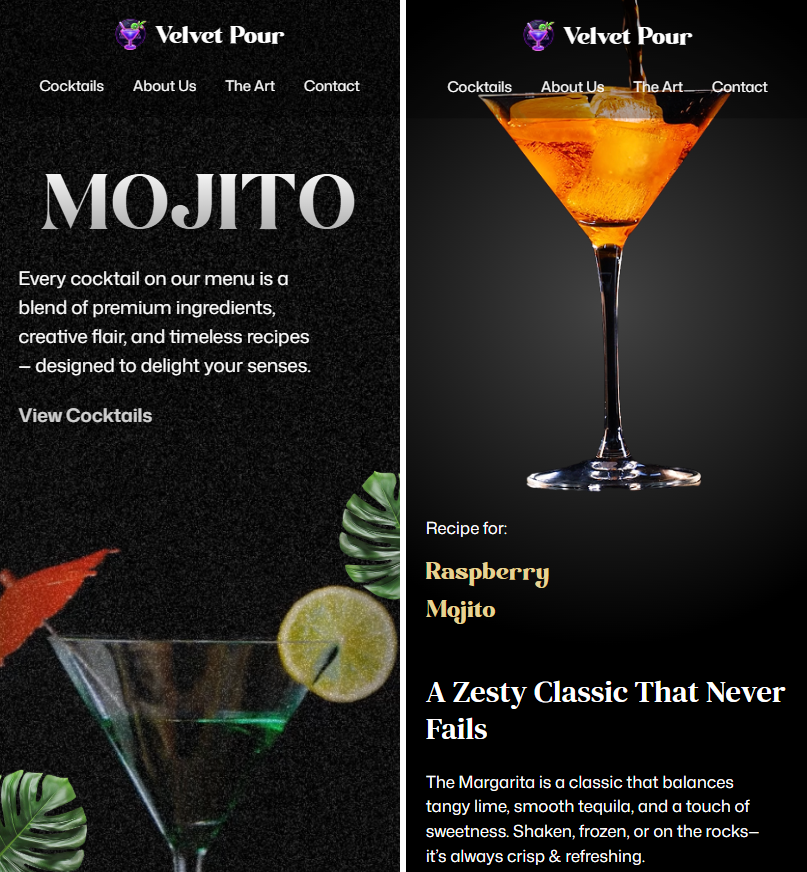

# Mojito Landing Page

A responsive cocktail-themed landing page built with **React**, **Vite**, **Tailwind CSS**, and **GSAP animations**.
This project is a **tutorial-based rebuild** from JS Mastery
, and the **design rights belong to JS Mastery**.

## 🚀 Features

- Smooth GSAP animations for engaging transitions

- Fully responsive layout (mobile, tablet, desktop)

- Modern Tailwind CSS styling

- Clean component structure with React

## 🛠️ Tech Stack

- React

- Tailwind CSS

- GSAP

## 📂 Project Setup

1.Clone the repository:

git clone https://github.com/Michelle-bit-web/mojito-landing-page.git
cd mojito-landing-page

2.Install dependencies:

npm install

3.Start the development server:

npm run dev

## 📸 Preview

### React + Vite

This template provides a minimal setup to get React working in Vite with HMR and some ESLint rules.

Currently, two official plugins are available:

- [@vitejs/plugin-react](https://github.com/vitejs/vite-plugin-react/blob/main/packages/plugin-react) uses [Babel](https://babeljs.io/) for Fast Refresh
- [@vitejs/plugin-react-swc](https://github.com/vitejs/vite-plugin-react/blob/main/packages/plugin-react-swc) uses [SWC](https://swc.rs/) for Fast Refresh

### 📜 Disclaimer

This project was built by following a **JS Mastery tutorial**.
The **design and assets are the intellectual property of JS Mastery**.
This repository is intended for learning purposes only.